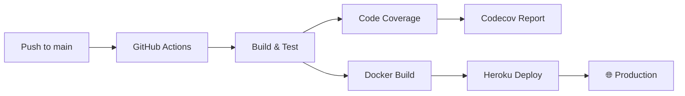

<div align="center">

#  Project Pulse

### Real-Time Collaborative Task Management

[](https://app1.anubhavsharma.dev)

<br/>

[](https://github.com/anubhavsharmawork/projectpulse/actions/workflows/ci-cd.yml)
[](https://codecov.io/gh/anubhavsharmawork/projectpulse)


<br/>

**A production-ready, full-stack application demonstrating enterprise-grade software engineering practices.**


</div>

---

##  Why This Project?

**Project Pulse** demonstrates:

| Skill Area | Implementation |
|------------|----------------|
| **Enterprise Architecture** | Clean Architecture with CQRS pattern using MediatR |
| **Real-Time Systems** | SignalR WebSocket hub for instant collaboration |
| **Security Engineering** | OWASP Top 10 compliance, JWT auth, rate limiting |
| **DevOps & CI/CD** | Automated GitHub Actions → Docker → Heroku pipeline |
| **Quality Assurance** | 85%+ code coverage with unit & integration tests |
| **Accessibility** | WCAG 2.1 Level AA, Lighthouse 100/100 |

---

##  Key Features

<table>
  <tr>
    <td style="vertical-align:top;">
      <h3>Project Management</h3>
      <ul>
        <li>Create and manage multiple projects</li>
        <li>Hierarchical work items (Epics → User Stories → Tasks)</li>
        <li>Real-time status tracking with Kanban-style workflow</li>
      </ul>
    </td>
    <td style="vertical-align:top;">
      <h3>Enterprise Security</h3>
      <ul>
        <li>JWT authentication with refresh tokens</li>
        <li>Rate limiting on all endpoints</li>
        <li>File upload validation & encryption</li>
      </ul>
    </td>
  </tr>
  <tr>
    <td style="vertical-align:top;">
      <h3>Team Collaboration</h3>
      <ul>
        <li>Role-based access control (Admin/Member)</li>
        <li>@mention notifications</li>
        <li>Real-time updates via SignalR</li>
      </ul>
    </td>
    <td style="vertical-align:top;">
      <h3>Analytics Dashboard</h3>
      <ul>
        <li>Project metrics and progress tracking</li>
        <li>Task completion analytics</li>
      </ul>
    </td>
  </tr>
</table>


---

##  Architecture

```
┌─────────────────────────────────────────────────────────────────────┐
│                         PRESENTATION LAYER                          │
├─────────────────────────────┬───────────────────────────────────────┤
│     Angular 16 SPA          │         .NET 8 Web API                │
│  • Angular Material UI      │      • REST Controllers               │
│  • SignalR Client           │      • SignalR Hub                    │
│  • Reactive Forms           │      • JWT Authentication             │
└─────────────────────────────┴───────────────────────────────────────┘
                                      │
                                      ▼
┌─────────────────────────────────────────────────────────────────────┐
│                         APPLICATION LAYER                           │
│  • CQRS with MediatR (Commands/Queries)                             │
│  • DTOs & Validation                                                │
│  • Business Logic & Domain Services                                 │
└─────────────────────────────────────────────────────────────────────┘
                                      │
                                      ▼
┌─────────────────────────────────────────────────────────────────────┐
│                           DOMAIN LAYER                              │
│  • Entities (Project, WorkItem, User, Comment)                      │
│  • Enums & Value Objects                                            │
│  • Domain Events                                                    │
└─────────────────────────────────────────────────────────────────────┘
                                      │
                                      ▼
┌─────────────────────────────────────────────────────────────────────┐
│                       INFRASTRUCTURE LAYER                          │
├───────────────────┬─────────────────────┬───────────────────────────┤
│   EF Core + PG    │    AWS S3 Storage   │     External Services     │
│   • Migrations    │    • File uploads   │     • Serilog Logging     │
│   • Repositories  │    • AES-256 enc.   │     • Papertrail          │
└───────────────────┴─────────────────────┴───────────────────────────┘
```

### Clean Architecture Benefits
- **Testability**: Business logic isolated from frameworks
- **Flexibility**: Swap infrastructure without touching domain
- **Maintainability**: Clear separation of concerns

---

##  Tech Stack

<table>
<tr>
<td align="center" width="20%"><br/><b>.NET 8</b><br/>Backend API</td>
<td align="center" width="20%"><br/><b>Angular 16</b><br/>Frontend SPA</td>
<td align="center" width="20%"><br/><b>PostgreSQL</b><br/>Database</td>
<td align="center" width="20%"><br/><b>Docker</b><br/>Containerization</td>
<td align="center" width="20%"><br/><b>AWS S3</b><br/>File Storage</td>
</tr>
</table>

| Category | Technologies |
|----------|-------------|
| **Backend** | .NET 8, ASP.NET Core, SignalR, MediatR, Entity Framework Core |
| **Frontend** | Angular 16, Angular Material, RxJS, TypeScript |
| **Database** | PostgreSQL 16, EF Core Migrations |
| **Authentication** | JWT, BCrypt, Role-based Authorization |
| **Testing** | xUnit, Moq, FluentAssertions, Integration Tests |
| **DevOps** | GitHub Actions, Docker, Heroku Container Registry |
| **Monitoring** | Serilog, Papertrail, Health Checks |

---

##  Project Metrics

<table>
<tr>
<td align="center">
<h3>85%+</h3>
<p>Code Coverage</p>
</td>
<td align="center">
<h3>100/100</h3>
<p>Lighthouse Score</p>
</td>
<td align="center">
<h3>OWASP</h3>
<p>Top 10 Compliant</p>
</td>
<td align="center">
<h3>WCAG 2.1</h3>
<p>Level AA</p>
</td>
</tr>
</table>

---

## Health Checks

- `/health/ready` : Readiness probe
- `/health/live` : Liveness probe

## Getting Started

### Prerequisites

- [.NET 8 SDK](https://dotnet.microsoft.com/download/dotnet/8.0)
- [Node.js 18+](https://nodejs.org/)
- [Angular CLI 16+](https://angular.io/cli)
- [PostgreSQL](https://www.postgresql.org/download/)
- [Docker](https://www.docker.com/) (optional)

### Quick Start

```bash
# Clone the repository
git clone https://github.com/anubhavsharmawork/projectpulse.git
cd projectpulse

# Setup environment
cp .env.template .env
# Configure your database connection and JWT settings in .env

# Backend
dotnet restore Project.sln
dotnet build Project.sln
cd src/API && dotnet run
# API available at https://localhost:5001
# Swagger at https://localhost:5001/swagger

# Frontend (new terminal)
cd frontend
npm install
npm run start:dev
# App available at http://localhost:4200
```

### Docker Deployment

```bash
# Build and run with Docker
docker build -t project-pulse .
docker run -p 5000:5000 project-pulse
```

---

## Security Implementation

This application implements comprehensive security controls aligned with **OWASP Top 10**:

<details>
<summary><b>Click to expand security details</b></summary>

| OWASP Risk | Implementation |
|------------|----------------|
| **A01: Broken Access Control** | Role-based authorization (`AdminPolicy`, `MemberPolicy`), JWT claims validation |
| **A02: Cryptographic Failures** | BCrypt password hashing, HMAC-SHA256 JWT, TLS enforced, S3 AES-256 |
| **A03: Injection** | EF Core parameterized queries, input validation, no raw SQL |
| **A04: Insecure Design** | Clean Architecture, file upload whitelist, size limits |
| **A05: Security Misconfiguration** | CSP, HSTS, X-Frame-Options, security headers |
| **A06: Vulnerable Components** | .NET 8 LTS, automated dependency updates |
| **A07: Auth Failures** | Rate limiting (10 req/min auth), generic errors, JWT expiry |
| **A08: Data Integrity** | CI/CD pipeline, container-based immutable deploys |
| **A09: Logging & Monitoring** | Serilog structured logging, security event tracking |
| **A10: SSRF** | No user-controlled external requests, AWS SDK only |

### Security Headers
```
Content-Security-Policy: default-src 'self'; ...
X-Content-Type-Options: nosniff
X-Frame-Options: DENY
Strict-Transport-Security: max-age=31536000; includeSubDomains
Referrer-Policy: strict-origin-when-cross-origin
Permissions-Policy: geolocation=(), microphone=(), camera=()
```

### Rate Limiting
| Endpoint | Limit |
|----------|-------|
| `/api/*/auth/*` | 10 requests/minute |
| `/api/*` | 100 requests/minute |

</details>

---

##  CI/CD Pipeline



**Pipeline Features:**
-  Automated testing on every PR / check-in
-  Code coverage enforcement (85% target)
-  Docker containerization
-  Zero-downtime deployment-ready

---

## Project Structure

```
projectPulseDec2025/
├── src/
│   ├── Domain/                   # Entities, Enums, Value Objects
│   ├── Application/              # CQRS Commands/Queries, DTOs, Interfaces
│   ├── Infrastructure/           # EF Core, AWS S3, External Services
│   └── API/                      # Controllers, SignalR Hub, Middleware
├── frontend/                     # Angular 16 SPA
│   ├── src/app/
│   │   ├── auth/                 # Login, Register components
│   │   ├── projects/             # Project management
│   │   ├── work-items/           # Epics, Stories, Tasks
│   │   └── core/                 # Services, Guards, Interceptors
├── tests/
│   ├── Application.UnitTests/    # Unit tests with Moq
│   └── API.IntegrationTests/     # Integration tests
├── .github/workflows/            # CI/CD pipelines
└── Dockerfile                    # Production container
```

---

## Testing Strategy

| Test Type | Tools | Coverage |
|-----------|-------|----------|
| **Unit Tests** | xUnit, Moq, FluentAssertions | Business logic, Handlers |
| **Integration Tests** | WebApplicationFactory, TestContainers | API endpoints, Database |
| **E2E** | Lighthouse CI | Performance, Accessibility |

```bash
# Run all tests
dotnet test Project.sln

# With coverage report
dotnet test --collect:"XPlat Code Coverage"
```

---

## Accessibility

WCAG 2.1 Level AA compliant with Lighthouse 100 score:

-  Full keyboard navigation
-  ARIA live regions for screen readers
-  Skip-to-content links
-  Reduced motion support
-  High contrast mode

---

## Engineering Decisions

<details>
<summary><b>Why Clean Architecture + CQRS?</b></summary>

- **Separation of Concerns**: Business logic independent of UI/database
- **Testability**: Easy to mock dependencies and test in isolation
- **Scalability**: Commands and queries can be scaled independently
- **Maintainability**: Clear patterns make onboarding easier

</details>

<details>
<summary><b>Why SignalR over WebSockets directly?</b></summary>

- Built-in connection management and reconnection
- Automatic fallback to long-polling
- Hub pattern for organized real-time logic
- Seamless integration with .NET authentication

</details>

<details>
<summary><b>Why PostgreSQL over SQL Server?</b></summary>

- Open source with excellent performance
- Better JSON support for flexible schemas
- Lower operational costs in cloud deployments
- Strong ecosystem and community

</details>


---

## Author

<div align="center">

**Anubhav Sharma**

*Building production applications with a focus on clean code and security.*

</div>


---

## License

This project is licensed under the MIT License - [LICENSE](LICENSE).

---


