# Project Pulse - UI Walkthrough Guide

> **Version:** 1.0  
> **Created By:** Anubhav Sharma

> **Last Updated:** 1 March 2026  
> **Open App:** [app1.anubhavsharma.dev](https://app1.anubhavsharma.dev)

---

## Table of Contents

1. [Application Overview](#1-application-overview)
2. [User Journey Map](#2-user-journey-map)
3. [Detailed Screen Walkthroughs](#3-detailed-screen-walkthroughs)
4. [UI Component Details](#4-ui-component-details)
5. [Interaction Patterns](#5-interaction-patterns)
6. [Screenshot Annotation Guide](#6-screenshot-annotation-guide)
7. [Accessibility Features](#7-accessibility-features)
8. [Mobile Responsive Views](#8-mobile-responsive-views)
9. [User Role Variations](#9-user-role-variations)

---

## 1. Application Overview

### Description

**Project Pulse** is a real-time collaborative task management platform built for enterprise teams. It enables teams to create projects across multiple industry domains (IT, Healthcare, Construction, Infrastructure), break work down into hierarchical items (Epics → User Stories → Tasks), track progress on a Kanban-style workflow board, manage team capacity, log time, and monitor analytics — all with live updates powered by SignalR WebSockets.

### Key Features

| Feature | Description |
|---------|-------------|
| **Projects** | Create, organise, and manage multi-domain projects with budget tracking |
| **Hierarchical Work Items** | Epics → User Stories → Tasks with domain-specific labelling |
| **Kanban Workflow Board** | Drag/transition cards through configurable workflow states |
| **Team Collaboration** | Role-based team assignment, capacity planning, @mention comments |
| **Analytics Dashboard** | Domain-specific KPIs, budget variance, completion rates |
| **Time Tracking** | Billable / non-billable hour logging per work item |
| **Asset Management** | Track project assets with type, status, location, and value |
| **Audit Logging** | Immutable history of all entity changes |
| **Multi-Tenant** | Tenant isolation with Starter / Business / Enterprise tiers |
| **Real-Time Updates** | SignalR-powered notifications, live badge counts, instant state changes |
| **Help Center** | Searchable slide-out help panel with categorised articles |
| **Legal Compliance** | Terms of Service and Privacy Policy acceptance gate |

### Tech Stack

| Layer | Technologies |
|-------|-------------|
| **Frontend** | Angular 16, Angular Material, RxJS, TypeScript |
| **Backend** | .NET 8, ASP.NET Core, SignalR, MediatR (CQRS) |
| **Database** | PostgreSQL 16, Entity Framework Core |
| **Auth** | JWT (short-lived + refresh tokens), BCrypt, Role-based Authorization |
| **Storage** | AWS S3 (AES-256 encrypted file uploads) |
| **DevOps** | GitHub Actions, Docker, Heroku Container Registry |
| **Monitoring** | Serilog, Papertrail, Health Checks |

---

## 2. User Journey Map

### Primary User Flow

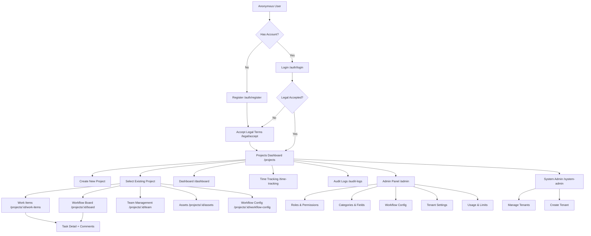

### Guard-Based Route Protection

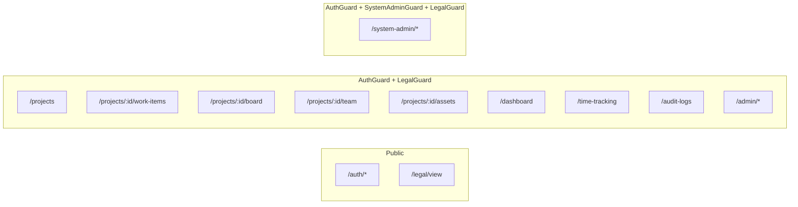

---

## 3. Detailed Screen Walkthroughs

---

### 3.1 Login - `/auth/login`

**User Goal:** Authenticate into the application with email/username and password.

**Context:** First screen for returning users. Provides demo credentials for easy evaluation.

#### Interactive Elements

| Element | Type | Component | Behaviour |
|---------|------|-----------|-----------|
| Email or Username | `<input matInput>` | `mat-form-field` (fill) | Required, min 2 chars, autocomplete=username |
| Password | `<input matInput>` | `mat-form-field` (fill) | Required, toggle visibility via eye icon |
| Show/Hide Password | `<button mat-icon-button>` | matSuffix | Toggles `type` between password/text |
| Sign In | `<button mat-flat-button>` | Primary colour | Disabled when form invalid or busy; shows `mat-spinner` (18px) while loading |
| Create one | `<a routerLink>` | Link | Navigates to `/auth/register` |

#### Navigation

| From | To |
|------|----|
| - | This screen is the entry point for unauthenticated users |
| "Create one" link | `/auth/register` |
| Successful login | `/projects` (or `/legal/accept` if terms not yet accepted) |

#### Real-Time Features

None - this is a pre-authentication screen.

#### Example Data

- **Email field:** `demo@demo.local`
- **Password field:** `demo123!`
- **Error state:** `Invalid credentials. Please check your email/username and password.`

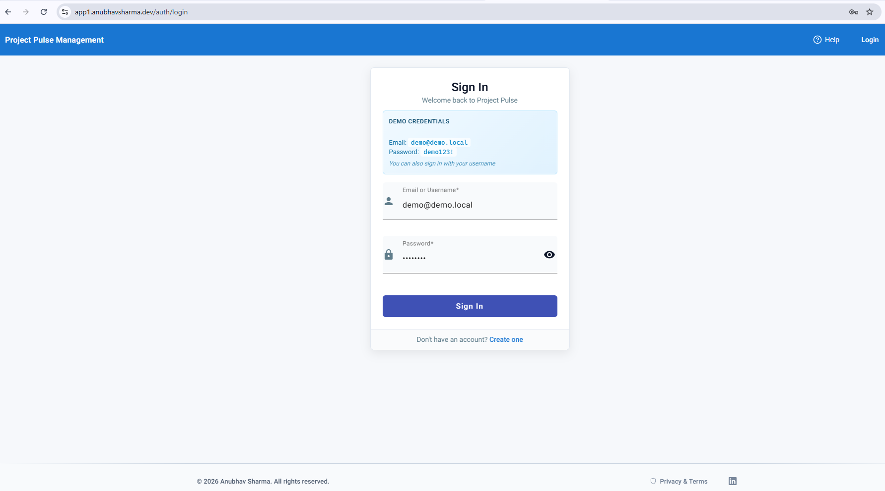

---

### 3.2 Registration

**User Goal:** Create a new account to join Project Pulse.

**Context:** New users arrive here from the Login screen's "Create one" link or the header "Register" button.

#### Interactive Elements

| Element | Type | Component | Behaviour |
|---------|------|-----------|-----------|
| Display name | `<input matInput>` | `mat-form-field` (fill) | Required, min 2 chars |
| Email address | `<input matInput type="email">` | `mat-form-field` (fill) | Required, email validation |
| Username | `<input matInput>` | `mat-form-field` (fill) | Auto-filled from email prefix, min 2, max 100 |
| Password | `<input matInput>` | `mat-form-field` (fill) | Required, min 6 chars, toggle visibility |
| Confirm Password | `<input matInput>` | `mat-form-field` (fill) | Must match password, toggle visibility |
| Terms checkbox | `<mat-checkbox>` | Angular Material | Required; links open modal overlays for Terms/Privacy |
| Create Account | `<button mat-flat-button>` | Primary | Disabled until valid + passwords match + terms accepted |
| Sign in | `<a routerLink>` | Link | `/auth/login` |

#### Navigation

| From | To |
|------|----|
| `/auth/login` → "Create one" | This screen |
| Successful registration | `/legal/accept` |
| "Sign in" link | `/auth/login` |

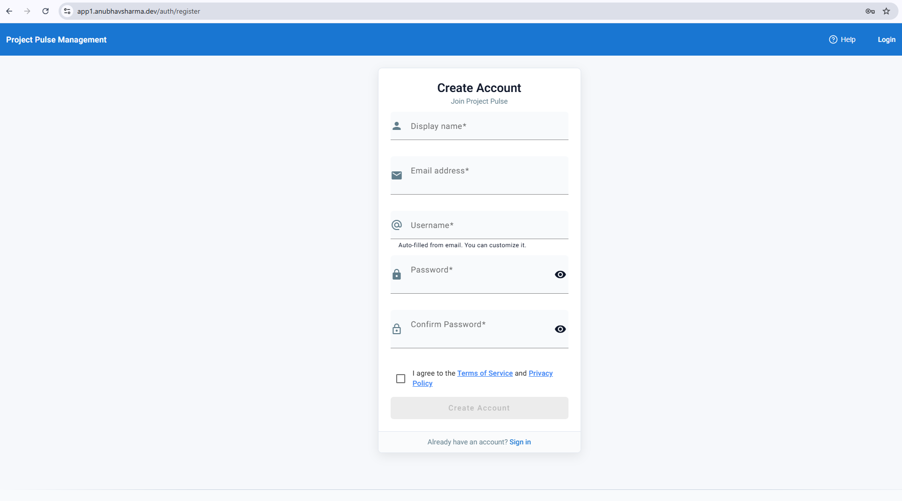

---

### 3.3 Legal

**User Goal:** Review and accept Terms of Service and Privacy Policy before using the application.

**Context:** This is a mandatory gate screen. The `LegalGuard` redirects users here if they haven't accepted the latest legal documents. Appears once after registration or when legal documents are updated.

#### Interactive Elements

| Element | Type | Behaviour |
|---------|------|-----------|
| Terms of Service toggle | `<button>` | Expands/collapses terms content |
| Privacy Policy toggle | `<button>` | Expands/collapses privacy content |
| Terms checkbox | `<input type="checkbox">` | Must be checked to enable submit |
| Privacy checkbox | `<input type="checkbox">` | Must be checked to enable submit |
| Accept & Continue | `<button>` | Disabled until both checkboxes checked; shows "Saving..." while busy |

#### Navigation

| From | To |
|------|----|
| `/auth/register` (after registration) | This screen |
| `/projects` (redirected by `LegalGuard`) | This screen |
| Successful acceptance | `/projects` |

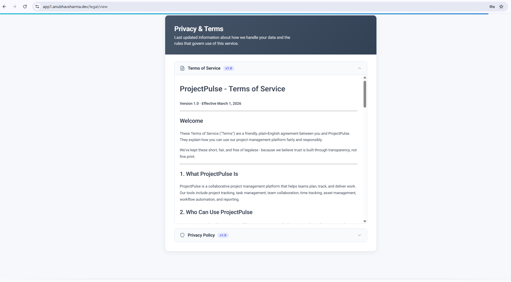

---

### 3.4 Projects

**User Goal:** View all projects, filter by ownership/visibility, and create new projects.

**Context:** This is the main landing page after authentication. It serves as the central hub for navigating into individual projects.

#### Interactive Elements

| Element | Type | Behaviour |
|---------|------|-----------|
| Tab filter (All / My / Public) | `<button>` with `role="tab"` | Switches between project lists; `aria-selected` tracks active tab |
| Project Name input | `<input>` | Required; disables Create button when empty |
| Description input | `<input>` | Optional |
| Domain select | `<select>` | Options: None, IT/Technology, Healthcare, Construction, Infrastructure |
| Est. Budget input | `<input type="number">` | Optional, min 0, step 100 |
| Visibility toggle | `<button role="radio">` group | Private (lock icon) / Public (globe icon) |
| Create Project button | `<button>` | Disabled when busy or name empty; shows "Creating..." |
| Work Items | `<button>` per card | Navigates to `/projects/:id/work-items` |
| Tasks | `<button>` per card | Navigates to `/projects/:id/tasks` |
| Board | `<button>` per card | Navigates to `/projects/:id/board` |
| Team | `<button>` per card | Navigates to `/projects/:id/team` |
| Assets | `<button>` per card | Navigates to `/projects/:id/assets` |
| Workflow Config (gear icon) | `<button>` per card | Navigates to `/projects/:id/workflow-config` |
| Delete (trash icon) | `<button>` per card | Deletes project (with confirmation) |
| Bugs | `<button>` | Visible only for IT domain projects |

#### Navigation

| From | To |
|------|----|
| Header "Projects" link | This screen |
| `/legal/accept` success | This screen |
| Card buttons | Various project sub-pages |

#### Real-Time Features

- Progress bars at page bottom update when tasks are completed in real-time via SignalR.

#### Example Data

| Project Name | Domain | Visibility | Budget Est. | Budget Actual |
|-------------|--------|-----------|-------------|---------------|
| Hospital Records Digitization | Healthcare | Private | $XX,XXX | $XX,XXX |
| E-Commerce Platform Rebuild | IT / Technology | Public | $XX,XXX | $XX,XXX |
| Highway Bridge Inspection | Infrastructure | Private | $XX,XXX | $XX,XXX |

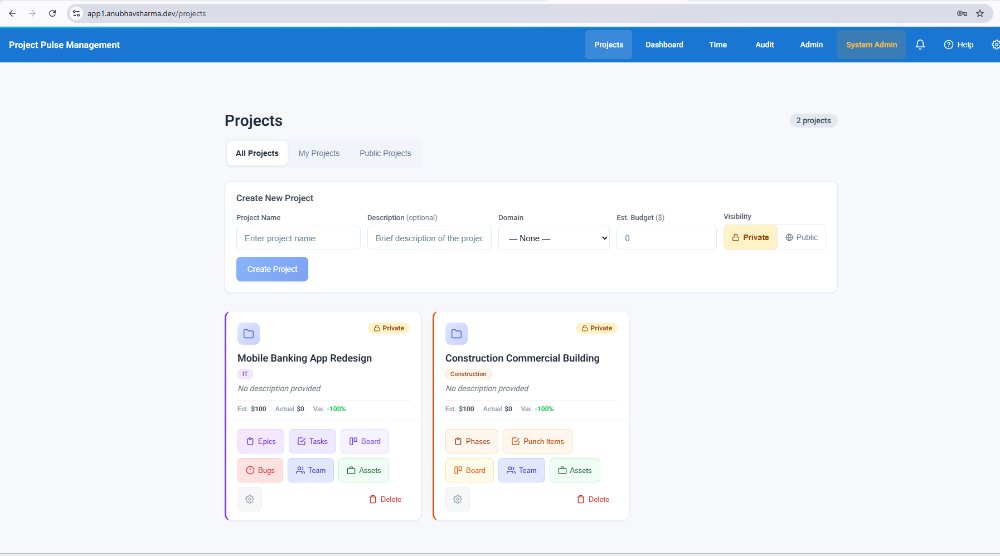

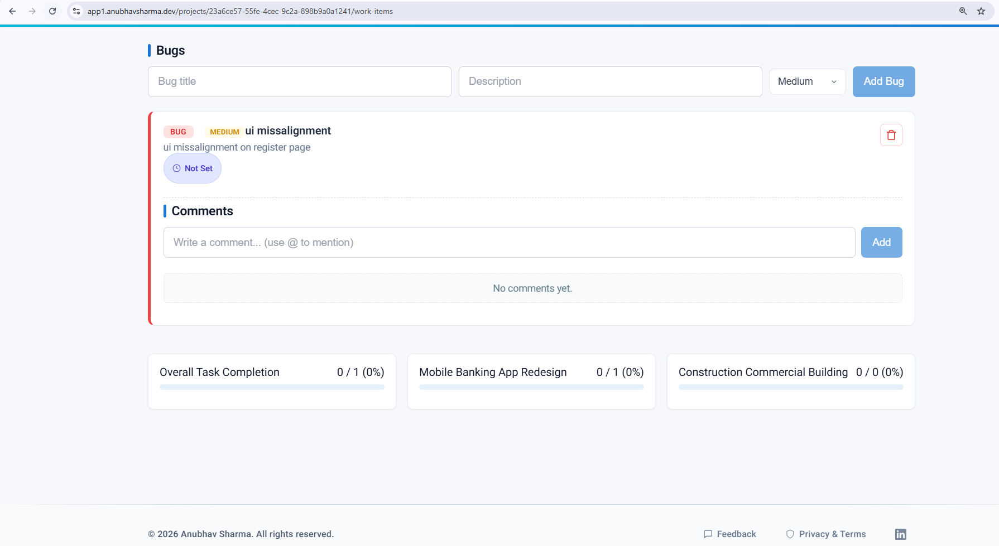

---

### 3.5 Create

**User Goal:** Create a new project with name, description, domain, budget, and visibility settings.

**Context:** The create form is inline on the Projects Dashboard (not a modal). It is always visible above the project card list.

> **Note:** Project Pulse uses an inline form on the `/projects` page rather than a separate modal dialog. Refer to §3.4 for the full layout.

#### Interactive Elements

Refer to the "Create New Project" section in §3.4. Key fields:

| Field | Required | Validation |
|-------|----------|-----------|
| Project Name | Yes | Non-empty string |
| Description | No | Free text |
| Domain | No | Dropdown: None, IT/Technology, Healthcare, Construction, Infrastructure |
| Est. Budget | No | Number ≥ 0 |
| Visibility | Yes | Radio group: Private (default) / Public |

#### Domain-Specific Behaviour

When a domain is selected, the project card renders with domain-coloured borders and badges. Work item labels change:

| Domain | Level 1 | Level 2 | Level 3 |
|--------|---------|---------|---------|
| IT / Technology | Epic | User Story | Task |
| Healthcare | Initiative | Care Plan | Action Item |
| Construction | Phase | Work Package | Activity |
| Infrastructure | Program | Project | Task |
| None (default) | Epic | User Story | Task |

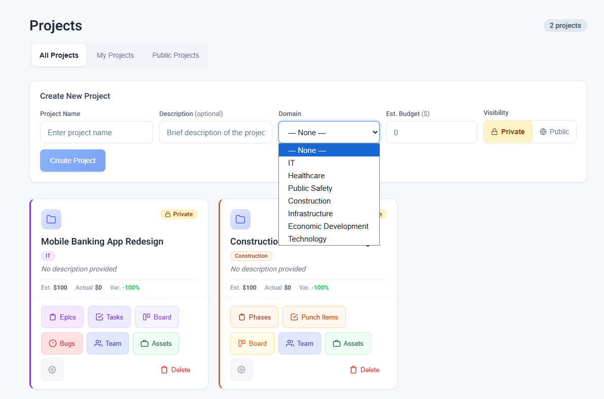

---

### 3.6 Project Work

**User Goal:** Create, organise, and manage hierarchical work items (Epics → User Stories → Tasks) within a project.

**Context:** Accessible from the project card's "Work Items" button. This is the primary work breakdown structure view.

#### Interactive Elements

| Element | Type | Behaviour |
|---------|------|-----------|
| Add Epic/Initiative form | Inline `<form>` | Title (required) + Description (optional) + Submit |
| Add User Story/Care Plan form | Inline `<form>` | Appears under expanded epic; Title (required) + Submit |
| Add Task/Action Item form | Inline `<form>` | Appears under expanded story; Title + Desc + Parent select + File attachment |
| Expand/Collapse button | `<button>` (chevron icon) | Toggles child visibility; `aria-expanded` state |
| Delete button | `<button>` (trash icon) | Removes work item |
| State badge (clickable) | `<button>` | Opens state dropdown to change workflow state |
| State dropdown | `
` with `<button>` options | Lists available states; clicking transitions the item |
| Workflow State component | `<app-workflow-state>` | Shows current state with colour; emits transitions |
| Custom Fields component | `<app-custom-fields>` | Domain-specific fields; validates required fields per state |
| Comments component | `<app-comments>` | Inline comments with @mention support (on tasks) |

#### Navigation

| From | To |
|------|----|
| `/projects` → "Work Items" button | This screen |
| Back to projects | Header "Projects" link |

#### Real-Time Features

- Work item state changes broadcast via SignalR to all connected clients.
- New items added by teammates appear in real-time.

#### Example Data

| Level | Title | State |
|-------|-------|-------|
| Initiative | Patient Onboarding Workflow | In Progress |
| Care Plan | Digital Intake Forms | Review |
| Action Item | Design intake form UI | Not Set |
| Action Item | Build API endpoints | Done |

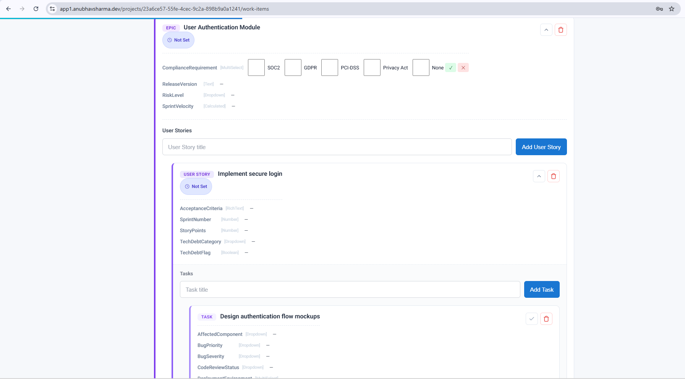

---

### 3.7 Kanban

**User Goal:** Visualise all work items by their workflow state in a columnar board layout and transition items between states.

**Context:** Accessible from the project card "Board" button. Provides a visual overview of work progress.

#### Interactive Elements

| Element | Type | Behaviour |
|---------|------|-----------|
| Board card | `
` | Hover/focus loads available transitions |
| Type badge | `` | Colour-coded by type (Epic/Story/Task) and domain |
| Assignee indicator | `` | Shows "Assigned" or "Unassigned" |
| Transition buttons (→) | `<button>` per transition | Moves item to target state; disabled while transitioning |
| Required fields dot (●) | `` | Indicates transition requires custom field values |

#### Column Structure

Each column represents a workflow state with:
- **Header:** State name + colour dot + item count + START/DONE markers
- **Body:** `role="list"` of board cards
- **Empty state:** "No items" placeholder

#### Navigation

| From | To |
|------|----|
| `/projects` → "Board" button | This screen |
| Card click (future) | Task detail side drawer |

#### Real-Time Features

- State transitions by other users update the board columns instantly via SignalR.
- Transition error alerts appear inline on each card.

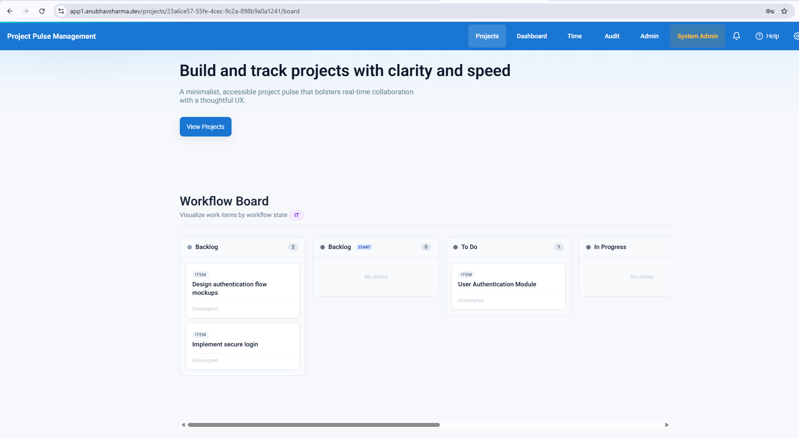

---

### 3.8 Task Detail

**User Goal:** View task details, add comments with @mentions, and manage task state.

**Context:** Task details are shown inline within the Work Items view (§3.6) rather than a separate side drawer. Each task row expands to reveal comments and action controls.

#### Interactive Elements

| Element | Type | Behaviour |
|---------|------|-----------|
| Comment input | `<input>` | Autocomplete=off; typing `@` triggers mention dropdown |
| @mention dropdown | `
` | Keyboard navigable (up/down/enter/escape) |
| Mention user item | `
` | Shows display name + email; click/enter inserts `@username` |
| Add button | `<button>` | Disabled when comment body is empty |
| Delete comment | `<button>` | Removes the comment |
| Comment body | `` | Renders @mentions as highlighted links |

#### Real-Time Features

- New comments from other users appear in real-time.
- @mention triggers a notification to the mentioned user (visible in Notification Bell).

---

### 3.9 Team

**User Goal:** Assign team members to a project, manage roles, skills, hourly rates, and monitor capacity utilisation.

**Context:** Accessible from the project card's "Team" button.

#### Interactive Elements

| Element | Type | Behaviour |
|---------|------|-----------|
| Username input | `<input>` | Blur event resolves user; shows ✓ name or error |
| Role select | `<select>` | Lists project roles from API |
| Skills input | `<input>` | Comma-separated, optional |
| Hours/week input | `<input type="number">` | Min 0, step 1 |
| Cost Rate input | `<input type="number">` | Min 0, step 5 |
| Assign button | `<button>` | Disabled when username empty or resolving |
| Unassign button | `<button>` per row | Removes member from project |
| Utilisation bar | `
` | Colour changes: green (<70%), amber (70–90%), red (>90%) |

#### Navigation

| From | To |
|------|----|
| `/projects` → "Team" button | This screen |

---

### 3.10 Analytics

**User Goal:** Monitor cross-project metrics, domain-specific KPIs, and budget health.

**Context:** Accessible from the header "Dashboard" link. Provides a high-level view of all project performance.

#### Interactive Elements

| Element | Type | Behaviour |
|---------|------|-----------|
| Domain filter | `<select>` | Filters KPIs by domain; triggers API reload |
| KPI cards | `
` | Colour-coded: green (completion), amber (overdue), blue (util.), purple (total) |
| Completion progress bar | `
` | Animated gradient fill |
| Velocity bars (IT) | `
` chart | 4-week trend visualisation |
| Budget table | `<table>` | Variance column colour: green (under budget), red (over) |

#### Navigation

| From | To |
|------|----|
| Header "Dashboard" link | This screen |

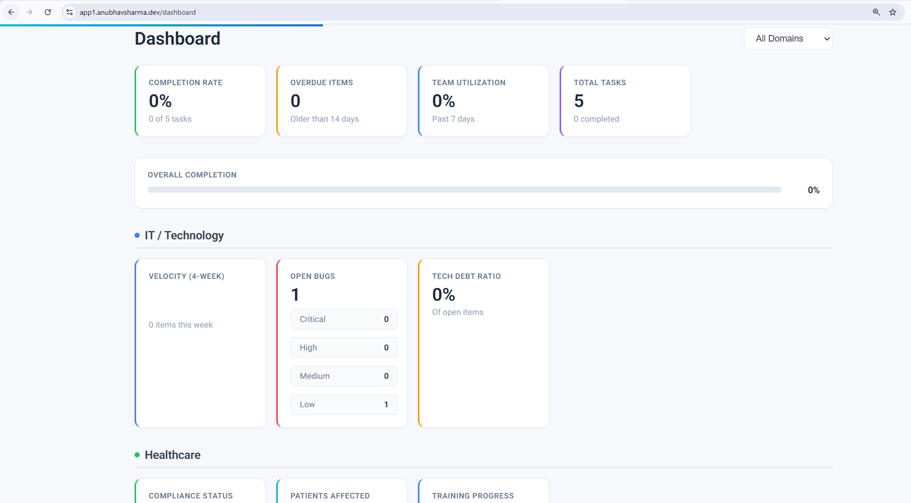

---

### 3.11 Time

**User Goal:** Log hours against work items and review time entries with filtering.

**Context:** Accessible from the header "Time" link.

#### Interactive Elements

| Element | Type | Behaviour |
|---------|------|-----------|
| Project select | `<select>` | Lists all projects; triggers work item reload |
| Work Item search | `<input>` with dropdown | Autocomplete search; shows type + title |
| Hours input | `<input type="number">` | Min 0.25, step 0.25 |
| Date input | `<input type="date">` | Defaults to today |
| Notes input | `<input>` | Optional |
| Billable checkbox | `<input type="checkbox">` | Toggles billable flag |
| Log Time button | `<button>` | Disabled until project + work item + hours are set |
| Filter controls | `<select>` + `<input type="date">` × 2 | Filters the entries table |
| Apply filter | `<button>` | Reloads entries with filter parameters |

#### Navigation

| From | To |
|------|----|
| Header "Time" link | This screen |

---

### 3.12 Notifications

**User Goal:** View real-time notifications for state transitions, assignment changes, overdue tasks, and @mentions.

**Context:** Always accessible from the header bell icon (🔔) when authenticated.

#### Interactive Elements

| Element | Type | Behaviour |
|---------|------|-----------|
| Bell button | `<button>` | Toggles dropdown; `aria-expanded`; badge shows unread count (99+ cap) |
| Mark all read | `<button>` | Marks all notifications as read; clears badge |
| Notification item | `
` | Clickable/keyboard-enter; marks as read on click |
| Unread indicator | CSS class `.unread` | Visual emphasis for unread items |

#### Notification Types & Icons

| Type | Icon Colour | Description |
|------|-------------|-------------|
| StateTransition | Purple (#8b5cf6) | Work item moved to new state |
| AssignmentChange | Blue (#3b82f6) | User assigned/unassigned from item |
| OverdueTask | Red (#ef4444) | Task past due date |
| Mention | Amber (#f59e0b) | User @mentioned in a comment |
| Default | Grey (#64748b) | Generic notification |

#### Real-Time Features

- Badge count updates instantly via SignalR when new notifications arrive.
- New notification items appear at the top of the dropdown without page refresh.

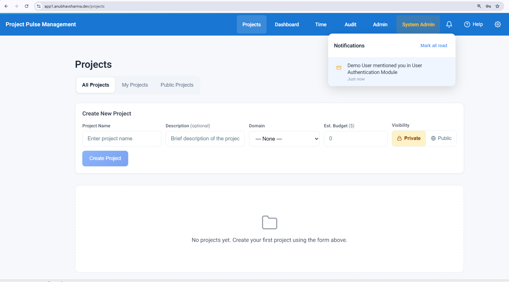

---

### 3.13 File Assets

**User Goal:** Manage project assets including hardware, software, and physical items with tracking metadata.

**Context:** Accessible from the project card's "Assets" button.

#### Interactive Elements

| Element | Type | Behaviour |
|---------|------|-----------|
| Search input | `<input>` | Debounced text search across asset fields |
| Status filter | `<select>` | All Statuses, Active, Maintenance, Retired, etc. |
| Type filter | `<select>` | All Types, Hardware, Software, Equipment, etc. |
| + New Asset button | `<button>` | Opens asset creation form |
| Table row | `<tr class="clickable-row">` | Click navigates to asset detail |
| View (eye icon) button | `<button>` | Opens asset detail view |
| Edit (pencil icon) button | `<button>` | Opens asset edit form |
| Pagination | Prev/Next `<button>` | Paginated results |

#### Navigation

| From | To |
|------|----|
| `/projects` → "Assets" button | This screen |
| Row click / View button | Asset detail view |

---

### 3.14 Admin

**User Goal:** Configure project roles, categories, custom fields, workflows, tenant settings, and usage limits.

**Context:** Accessible from the header "Admin" link. Uses a sidebar + content layout with nested routing. View-only access for non-admin / demo users.

#### Admin Sub-Pages

| Route | Sub-Component | Purpose |
|-------|---------------|---------|
| `/admin/roles` | `AdminRolesComponent` | Manage project roles and permissions |
| `/admin/categories` | `AdminCategoriesComponent` | Manage work item categories and custom fields |
| `/admin/workflows` | `AdminWorkflowsComponent` | Configure workflow states and transitions |
| `/admin/tenant/settings` | `TenantSettingsComponent` | Tenant name, branding (admin-only) |
| `/admin/tenant/usage` | `TenantUsageComponent` | View usage metrics and plan limits (admin-only) |

#### Interactive Elements

| Element | Type | Behaviour |
|---------|------|-----------|
| Sidebar links | `<a routerLink>` | Active state via `routerLinkActive="active"` |
| Role indicator | `
` badge | Shows "Admin Access" (shield) or "View Only" (eye) |
| Tenant sections | Conditional `*ngIf` | Only visible to `isWriteAdmin` users |

#### Navigation

| From | To |
|------|----|
| Header "Admin" link | This screen |
| Sidebar links | Child routes within admin layout |

---

### 3.15 System

**User Goal:** Manage multi-tenant infrastructure: view tenants, create new tenants, suspend/activate tenants.

**Context:** Only accessible to System Administrator users (enforced by `SystemAdminGuard`). Demo users see a read-only banner.

#### Interactive Elements

| Element | Type | Behaviour |
|---------|------|-----------|
| + New Tenant button | `<button routerLink>` | Navigates to `system-admin/create-tenant` |
| Search input | `<input>` | Client-side filter on tenant name/subdomain |
| Tier filter | `<select>` | Starter / Business / Enterprise / All |
| Suspend/Activate button | `<button>` per row | Toggles tenant active status; disabled for demo users |
| Stat cards | `
` | Display counts: Total, Active, Suspended, Enterprise |

#### Tier Badge Colours

| Tier | CSS Class |
|------|-----------|
| Starter | `.tier-starter` |
| Business | `.tier-business` |
| Enterprise | `.tier-enterprise` |

#### Navigation

| From | To |
|------|----|
| Header "System Admin" link | This screen |
| "+ New Tenant" button | `/system-admin/create-tenant` |

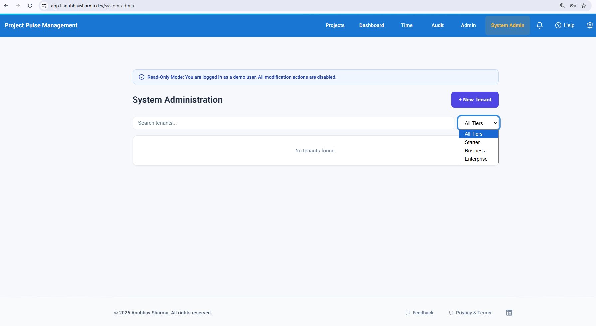

---

### 3.16 User Preferences

**User Goal:** Configure personal preferences such as timezone.

**Context:** Accessible from the header gear icon (⚙) when authenticated. Renders as a dropdown dialog.

#### Interactive Elements

| Element | Type | Behaviour |
|---------|------|-----------|
| Gear button | `<button>` | Toggles dropdown; `aria-expanded` |
| Timezone select | `<select>` | Lists all IANA timezones |
| Save button | `<button>` | Disabled when selection matches saved value or while saving |
| Close button (✕) | `<button>` | Closes dropdown; also closes on `Escape` key or outside click |
| Saved indicator | `` with checkmark | Shows "Saved" with `aria-live="polite"` |

---

### 3.17 Audit

**User Goal:** Review immutable history of all entity changes for compliance and debugging.

**Context:** Accessible from the header "Audit" link. Restricted to administrators; non-admin users see a permission banner.

---

### 3.18 Help

**User Goal:** Search and browse help articles without leaving the current page.

**Context:** Accessible from the header "Help" button (?) icon. Slides in from the right as an overlay panel.

#### Key Features

- Slide-in/out animation (`[@slideInOut]`)
- Modal overlay with click-outside-to-close
- Searchable with real-time result count
- Categorised articles with expand/collapse
- Full keyboard navigation with focus trapping
- `aria-modal="true"` for screen readers

---

## 4. UI Component

### 4.1 Global Header (Navigation Bar)

The header is present on all pages and adapts based on authentication state.

| Element | Visibility | Component |
|---------|-----------|-----------|
| Brand "Project Pulse Management" | Always | `` with click/enter/space → home |
| Projects link | Authenticated | `<a routerLink="/projects">` |
| Dashboard link | Authenticated | `<a routerLink="/dashboard">` |
| Time link | Authenticated | `<a routerLink="/time-tracking">` |
| Audit link | Authenticated | `<a routerLink="/audit-logs">` |
| Admin link | Authenticated | `<a routerLink="/admin">` |
| System Admin link | Authenticated + SystemAdmin role | `<a routerLink="/system-admin">` |
| Tenant indicator | Authenticated + has tenant | `` showing name + tier badge |
| Notification bell | Authenticated | `<app-notification-bell>` |
| Help button | Always | `<button>` → toggles help panel |
| User Preferences | Authenticated | `<app-user-prefs>` |
| Login / Register | Not authenticated | `<a routerLink>` links |
| Logout | Authenticated | `<button>` |

### 4.2 Hero Section

Shown below the header on non-auth pages. Contains:

- **Heading:** "Build and track projects with clarity and speed"
- **Tagline:** Descriptive subtitle
- **CTA buttons:** "View Projects" / "Login to View Projects" + "Try Demo Login" (anonymous only)

### 4.3 Footer

- **Feedback button:** Opens feedback modal (authenticated only)
- **Privacy & Terms:** Link to `/legal/view`
- **LinkedIn:** External link with `target="_blank"` and `rel="noreferrer noopener"`

### 4.4 Task Completion Progress Section

Shown on the main page below the `<router-outlet>` for authenticated users:

- **Overall progress bar** with `role="progressbar"`
- **Per-project progress bars** with individual labels
- Loading/error states with `aria-live` announcements

### 4.5 Angular Material Components Used

| Component | Usage Location |
|-----------|---------------|
| `mat-form-field` (fill appearance) | Login, Register forms |
| `mat-input` / `matInput` | All form text inputs on auth screens |
| `mat-icon` | Form prefixes, error indicators, toggle buttons |
| `mat-icon-button` | Password visibility toggle |
| `mat-flat-button` | Submit buttons (Sign In, Create Account) |
| `mat-spinner` | Loading state in submit buttons (18px diameter) |
| `mat-error` | Inline validation error messages |
| `mat-checkbox` | Terms acceptance on registration |
| `mat-label` | Form field labels |
| `matPrefix` / `matSuffix` | Icon positioning within form fields |

### 4.6 Responsive Behaviour Notes

- **Header:** Nav links collapse; brand stays visible
- **Hero:** Text and CTA stack vertically on narrow viewports
- **Project cards:** Grid layout adjusts from multi-column to single-column
- **Dashboard KPI grid:** Wraps from 4-across to 2-across to 1-column
- **Board columns:** Horizontal scroll (`board-scroll`) on narrow screens
- **Tables:** Wrapped in scrollable `
` containers
- **Auth pages:** Centred card layout that scales down gracefully

---

## 5. Interaction Patterns

### 5.1 Form Validation States

| State | Visual | Implementation |
|-------|--------|----------------|
| **Pristine** | Normal borders, no messages | Default state |
| **Invalid + Touched** | Red border + `<mat-error>` message | Angular template-driven validation (`#input="ngModel"`) |
| **Valid** | Normal or success state | No error message shown |
| **Server Error** | Red error banner with `mat-icon error_outline` | `
` |

**Common Validation Rules:**
- Email: `required`, `email` validator
- Password: `required`, `minlength="6"`
- Display name: `required`, `minlength="2"`
- Project name: `required`, non-empty after trim

### 5.2 Loading States

| Context | Indicator | ARIA |
|---------|-----------|------|
| Page data loading | `"Loading..."` text with `role="status"` | `aria-live="polite"` |
| Button submit | `mat-spinner` (18px) + "Signing in..." / "Creating..." text | `[attr.aria-busy]="busy"` |
| Entries loading | `"Loading time entries…"` | `aria-live="polite"` |
| Board loading | `"Loading board…"` | `role="status"`, `aria-live="polite"` |

### 5.3 Empty States

| Screen | Empty State Message | CTA |
|--------|-------------------|-----|
| Projects (All) | "No projects yet. Create your first project using the form above." | Form is visible above |
| Projects (Mine) | "You don't have any projects yet. Create one using the form above." | Form is visible above |
| Projects (Public) | "No public projects available." | - |
| Team Members | "No team members yet. Assign users to this project using the form above." | Assignment form above |
| Notifications | Bell icon + "No unread notifications" | - |
| Comments | "No comments yet." | Comment input above |
| Time Entries | "No time entries found." | - |
| Assets | "No assets found. Create your first asset using the button above." | + New Asset button |
| Board | "No workflow defined or no work items in this project." | - |
| Dashboard | "No dashboard data available." | - |
| Audit Logs | "No audit log entries match your filters." | Clear/adjust filters |

### 5.4 Success/Error Notifications

| Type | Implementation | Duration |
|------|---------------|----------|
| **Inline error** | Red text with `role="alert"` and `aria-live="assertive"` | Persistent until resolved |
| **Inline success** | Green text (e.g., "✓ Jane Smith" for user resolve) | Persistent |
| **Saved confirmation** | Checkmark + "Saved" with `aria-live="polite"` | Auto-dismisses |
| **Permission denied** | Banner with lock icon + message | Persistent |
| **Demo mode** | Info banner at top of page | Persistent |

### 5.5 Confirmation Dialogs

- **Delete project:** `confirm()` browser dialog before removal
- **Unassign member:** Direct action (no dialog for simplicity)
- **Suspend tenant:** Direct toggle with disabled state for demo users

### 5.6 Drag-and-Drop Behaviour (Kanban Board)

The Workflow Board uses a **button-based transition model** rather than native drag-and-drop:

1. User hovers/focuses a card → available transitions load via API
2. Transition buttons appear (e.g., "→ In Progress", "→ Review")
3. Clicking a transition button moves the item to the target column
4. If required custom fields are missing, a red dot (●) appears and an error message is shown
5. The card animates to its new column position

### 5.7 Real-Time Updates via SignalR

| Feature | Trigger | UI Effect |
|---------|---------|-----------|
| **Notification badge** | New notification created | Bell badge count increments |
| **Task progress** | Task completed/uncompleted | Progress bars update on main page |
| **Board state** | Work item state transition | Card moves between columns |
| **Comments** | New comment added | Comment list refreshes |
| **@mention** | User mentioned in comment | Mention notification appears in bell dropdown |

### 5.8 @mention Autocomplete

1. User types `@` in comment input
2. Dropdown appears with `role="listbox"` showing team members
3. Keyboard navigation: `↑`/`↓` to move, `Enter` to select, `Escape` to close
4. Selected user's `@username` is inserted into the comment text
5. On submit, backend processes mentions and creates notifications
6. Rendered comments highlight mentions with styled `` elements

---

## 6. Screenshot Annotation Guide

### General Requirements

For each screenshot, capture at **1280×800** minimum resolution in a Chromium-based browser.

### 6.1 Login Screen  

| Annotation | Position | Content |
|-----------|----------|---------|
| Callout A | Top of card | "Auth card with centered layout" |
| Callout B | Demo hint box | "Demo credentials displayed for easy testing" |
| Callout C | Email field | Populate with `demo@demo.local` |
| Callout D | Password field | Populate with `demo123!` (dots) |
| Callout E | Eye icon | "Toggle password visibility" |
| Callout F | Submit button | Capture both enabled and disabled states |
| Callout G | Footer link | "Navigation to registration" |

### 6.2 Registration Screen  

| Annotation | Position | Content |
|-----------|----------|---------|
| Callout A | Display name | Populate: "Jane Smith" |
| Callout B | Email | Populate: "jane.smith@example.com" |
| Callout C | Username | Show auto-fill: "jane.smith" with hint text |
| Callout D | Password mismatch | Capture the warning state |
| Callout E | Terms checkbox | Show both checked and unchecked states |

### 6.3 Legal Acceptance  

| Annotation | Position | Content |
|-----------|----------|---------|
| Callout A | Expandable Terms section | Show expanded with scrollable content |
| Callout B | Version badge | Highlight "v1.0" badge |
| Callout C | Both checkboxes | Show both checked |
| Callout D | Accept button | Show enabled state |

### 6.4 Projects Dashboard  

| Annotation | Position | Content |
|-----------|----------|---------|
| Callout A | Tab filter | Highlight "All Projects" active tab |
| Callout B | Create form | Show filled: "New API Gateway", IT domain, $XX,XXX |
| Callout C | Project card | Annotate: icon, visibility badge, domain badge, budget row |
| Callout D | Action buttons | Label each: Work Items, Tasks, Board, Team, Assets, gear, trash |
| Callout E | Progress section | Show 2-3 project progress bars |
| **Visual state** | | Capture with 3+ project cards visible |

### 6.5 Work Items View  

| Annotation | Position | Content |
|-----------|----------|---------|
| Callout A | Domain badge | Show "Healthcare" with colour |
| Callout B | Epic card | Expanded with 2 Care Plans visible |
| Callout C | Workflow state button | Show clickable state badge |
| Callout D | Nested tree | Highlight 3-level hierarchy |
| **Sample data** | | Epic: "Patient Onboarding", Story: "Digital Intake", Task: "Design UI" |

### 6.6 Workflow Board  

| Annotation | Position | Content |
|-----------|----------|---------|
| Callout A | Column headers | Label: state name, item count, START/DONE markers |
| Callout B | Board card | Annotate: type badge, title, assignee, transition buttons |
| Callout C | Transition button | Highlight "→ Review" button |
| Callout D | Required dot | Show red required-fields indicator |
| **Columns** | | 4 columns: Backlog (3), In Progress (2), Review (1), Done (4) |

### 6.7 Team Management  

| Annotation | Position | Content |
|-----------|----------|---------|
| Callout A | KPI cards | Annotate each: Members, Hours, Allocated, Utilization |
| Callout B | Assign form | Show with resolved user: "✓ Jane Smith" |
| Callout C | Members table | 3-5 members with varied roles and skills |
| Callout D | Capacity table | Show utilisation bars at different levels |

### 6.8 Analytics Dashboard  

| Annotation | Position | Content |
|-----------|----------|---------|
| Callout A | Domain filter | Show dropdown with "All" selected |
| Callout B | KPI cards | Label: Completion (72%), Overdue (3), Utilization (68%), Total (45) |
| Callout C | Domain sections | Show at least IT + Healthcare KPIs |
| Callout D | Budget table | 3 projects with varied variance colours |

### 6.9 Notifications 

| Annotation | Position | Content |
|-----------|----------|---------|
| Callout A | Bell icon | Show badge with "3" |
| Callout B | Dropdown open | Show 3-4 notification types |
| Callout C | Type icons | Label each colour/icon pair |
| Callout D | Mark all read | Highlight button |

### 6.10 System Admin  

| Annotation | Position | Content |
|-----------|----------|---------|
| Callout A | Demo banner | "Read-Only Mode" warning |
| Callout B | Stats row | 5 tenants, 4 active, 1 suspended, 2 enterprise |
| Callout C | Tier badges | Show all three tiers |
| Callout D | Status badges | Active (green) vs Suspended (red) |

---

## 7. Accessibility Features

### 7.1 WCAG 2.1 Level AA Compliance

Project Pulse achieves a **Lighthouse Accessibility score of 100/100**.

### 7.2 Keyboard Navigation

| Screen | Shortcut | Action |
|--------|----------|--------|
| Global | `Tab` / `Shift+Tab` | Navigate between interactive elements |
| Brand logo | `Enter` / `Space` | Navigate to home |
| Notification bell | `Enter` | Toggle dropdown |
| Help panel | `Escape` | Close panel |
| Preferences dropdown | `Escape` | Close dropdown |
| Project card list | `↑` / `↓` arrows | Move between cards (`onListKeydown`) |
| Work item tree | `↑` / `↓` arrows | Navigate tree items (`onTreeKeydown`) |
| Comment list | `↑` / `↓` arrows | Navigate comments (`onListKeydown`) |
| @mention dropdown | `↑` / `↓` | Move selection; `Enter` = select; `Escape` = close |
| Board cards | `Tab` through cards | Focus triggers transition loading |

### 7.3 ARIA Labels & Roles

| Pattern | Example |
|---------|---------|
| `role="banner"` | Site header |
| `role="navigation"` | Topbar nav, admin sidebar, footer links |
| `role="main"` | Main content area |
| `role="contentinfo"` | Footer |
| `role="tablist"` / `role="tab"` | Project filter tabs |
| `role="tree"` / `role="treeitem"` | Work items hierarchy |
| `role="list"` / `role="listitem"` | Project cards, KPI cards, notifications, comments |
| `role="progressbar"` | All progress bars with `aria-valuenow`, `aria-valuemin`, `aria-valuemax` |
| `role="dialog"` / `aria-modal` | Help panel, preferences dropdown |
| `role="listbox"` / `role="option"` | @mention autocomplete |
| `role="form"` | All forms with `aria-label` |
| `role="region"` | Board, comments, help content |
| `role="alert"` | Error messages with `aria-live="assertive"` |
| `role="status"` | Loading indicators, counts with `aria-live="polite"` |
| `role="radiogroup"` | Visibility toggle (Private/Public) |

### 7.4 Focus Indicators

- All interactive elements have visible focus outlines (browser default + custom styles)
- Help panel implements **focus trapping** (`onPanelKeydown` handler)
- Modal overlays prevent background interaction

### 7.5 Screen Reader Announcements

| Event | Announcement Type | ARIA Attribute |
|-------|------------------|----------------|
| Loading state | Polite | `aria-live="polite"` |
| Error message | Assertive | `aria-live="assertive"`, `role="alert"` |
| Project count | Status | `role="status"` |
| Progress update | Polite | `aria-live="polite"` on progress section |
| Save confirmation | Polite | `aria-live="polite"` on "Saved" indicator |
| Empty state | Polite | `role="status"`, `aria-live="polite"` |
| Search results count | Status | `role="status"`, `aria-live="polite"` |

### 7.6 Skip Links & Hidden Labels

- `class="sr-only"` is used for visually hidden labels on form inputs (e.g., task title, comment input)
- Progress section has `<h2 class="sr-only">Task Completion Progress</h2>`
- Decorative icons use `aria-hidden="true"`

---

## 8. Mobile Responsive Views

### 8.1 Screens with Mobile-Specific Adaptations

| Screen | Key Mobile Differences |
|--------|----------------------|
| **Header** | Nav links may wrap or collapse; brand always visible |
| **Hero** | Text and CTA buttons stack vertically; reduced font size |
| **Auth (Login/Register)** | Card takes full width with padding; remains centred |
| **Projects Dashboard** | Cards stack in single column; create form fields stack vertically |
| **Workflow Board** | Horizontal scroll container (`board-scroll`); columns maintain min-width |
| **Dashboard KPIs** | KPI grid wraps from 4-column → 2-column → 1-column |
| **Team Management** | Tables gain horizontal scroll wrapper; KPI cards stack |
| **Time Tracking** | Form fields stack; table scrolls horizontally |
| **Assets** | Table scrolls horizontally; filters stack |
| **Admin Panel** | Sidebar collapses or stacks above content |
| **Notifications** | Dropdown may take full width on small screens |

### 8.2 Breakpoint Strategy

The application uses CSS-based responsive design with:
- **Fluid layouts** using flexbox and CSS grid
- **Container max-widths** for readability
- **Scrollable wrappers** (`table-wrapper`, `board-scroll`) for data-dense views

---

## 9. User Role Variations

### 9.1 Anonymous Users (Not Authenticated)

| Visible | Hidden |
|---------|--------|
| Header: Brand, Login, Register, Help | All nav links (Projects, Dashboard, Time, Audit, Admin) |
| Hero section with "Login to View Projects" CTA + "Try Demo Login" | Notification bell, User Preferences, Logout |
| Footer: Privacy & Terms, LinkedIn | Feedback button |
| `/auth/login`, `/auth/register`, `/legal/view` | All guarded routes |

### 9.2 Regular Authenticated Users

| Visible | Hidden |
|---------|--------|
| All main nav links: Projects, Dashboard, Time, Audit, Admin | System Admin link |
| Notification bell with unread count | Tenant-level admin settings (Settings, Usage) in Admin panel |
| User Preferences gear icon | - |
| Logout button | - |
| Feedback button in footer | - |
| Hero shows "View Projects" CTA | "Try Demo Login" button |
| All project operations (create, CRUD) | - |

### 9.3 Project Members

Same as Regular Authenticated Users, with additional access to:
- Work Items, Tasks, Board, Team, Assets for projects they're assigned to
- Comments with @mention for team members
- Time logging against project work items

### 9.4 Project Admins (Write Admins)

Everything from Project Members, plus:

| Feature | Access |
|---------|--------|
| Admin Panel → Roles & Permissions | Full CRUD |
| Admin Panel → Categories & Fields | Full CRUD |
| Admin Panel → Workflow Config | Full CRUD |
| Admin Panel → Tenant Settings | Full access |
| Admin Panel → Usage & Limits | Full access |
| Role indicator | Shows "(shield) Admin Access" |
| Team management | Can assign/unassign members |
| Project deletion | Enabled |

### 9.5 Demo Users

Same as Project Admins but with restrictions:

| Feature | Behaviour |
|---------|-----------|
| Admin Panel | Shows "View Only" role indicator |
| System Admin | Shows "Read-Only Mode" banner |
| Modification actions | Disabled buttons with tooltip explanations |
| Tenant creation | Form visible but submissions blocked |
| Suspend/Activate | Disabled with "Demo users have read-only access" tooltip |

### 9.6 System Administrators

Everything from Project Admins, plus:

| Feature | Access |
|---------|--------|
| Header "System Admin" link | Visible (`.sa-link` styled) |
| `/system-admin` route | Accessible (guarded by `SystemAdminGuard`) |
| Tenant management | View all tenants, create new, suspend/activate |
| Tenant stats | Total, Active, Suspended, Enterprise counts |
| Cross-tenant visibility | All tenants visible in dashboard |

### UI Visibility Matrix

| Feature             | Anon | User | Member | PAdmin | SysAdmin |
|---------------------|------|------|--------|--------|----------|
| Login/Register      | Yes  |      |        |        |          |
| Legal Acceptance    |      | Yes  | Yes    | Yes    | Yes      |
| Projects Dashboard  |      | Yes  | Yes    | Yes    | Yes      |
| Work Items/Board    |      | Yes  | Yes    | Yes    | Yes      |
| Team Management     |      | Yes  | Yes    | Yes    | Yes      |
| Dashboard           |      | Yes  | Yes    | Yes    | Yes      |
| Time Tracking       |      | Yes  | Yes    | Yes    | Yes      |
| Audit Logs          |      | Perm | Perm   | Yes    | Yes      |
| Admin Panel (view)  |      | View | View   | Yes    | Yes      |
| Admin Tenant Config |      |      |        | Yes    | Yes      |
| System Admin        |      |      |        |        | Yes      |
| Notification Bell   |      | Yes  | Yes    | Yes    | Yes      |
| User Preferences    |      | Yes  | Yes    | Yes    | Yes      |
| Help Panel          | Yes  | Yes  | Yes    | Yes    | Yes      |
| Feedback            |      | Yes  | Yes    | Yes    | Yes      |

Legend: Yes = Full access, View = View-only, Perm = Permission required

---

## Appendix A: Route Summary

| Route | Module | Guards | Description |
|-------|--------|--------|-------------|
| `/` | - | - | Redirects to `/projects` |
| `/auth/login` | `AuthModule` | None | Login page |
| `/auth/register` | `AuthModule` | None | Registration page |
| `/legal/accept` | `LegalModule` | `AuthGuard` | Legal acceptance gate |
| `/legal/view` | `LegalModule` | None | Public legal document viewer |
| `/projects` | `ProjectsModule` | `AuthGuard`, `LegalGuard` | Projects dashboard |
| `/projects/:id/work-items` | `WorkItemsModule` | `AuthGuard`, `LegalGuard` | Hierarchical work items |
| `/projects/:id/tasks` | `TasksModule` | `AuthGuard`, `LegalGuard` | Orphan tasks view |
| `/projects/:id/board` | `WorkflowBoardModule` | `AuthGuard`, `LegalGuard` | Kanban workflow board |
| `/projects/:id/team` | `TeamManagementModule` | `AuthGuard`, `LegalGuard` | Team capacity management |
| `/projects/:id/assets` | `AssetsModule` | `AuthGuard`, `LegalGuard` | Asset management |
| `/projects/:id/workflow-config` | `WorkflowConfigModule` | `AuthGuard`, `LegalGuard` | Workflow state/transition config |
| `/dashboard` | `DashboardModule` | `AuthGuard`, `LegalGuard` | Analytics dashboard |
| `/time-tracking` | `TimeTrackingModule` | `AuthGuard`, `LegalGuard` | Time logging and entries |
| `/audit-logs` | `AuditLogModule` | `AuthGuard`, `LegalGuard` | Entity change history |
| `/admin` | `AdminModule` | `AuthGuard`, `LegalGuard` | Admin panel with sidebar |
| `/system-admin` | `SystemAdminModule` | `AuthGuard`, `SystemAdminGuard`, `LegalGuard` | Multi-tenant admin |
| `**` | — | — | 404 Not Found page |

## Appendix B: Shared Modules Loaded Globally

| Module | Component | Purpose |
|--------|-----------|---------|
| `NotificationsModule` | SignalR notification service | Real-time notification infrastructure |
| `MentionsModule` | `MentionNotificationsComponent` | @mention notification dropdown |
| `NotificationBellModule` | `NotificationBellComponent` | Bell icon + notification dropdown |
| `HelpPanelModule` | `HelpPanelComponent` | Slide-out help centre |
| `UserPrefsModule` | `UserPrefsComponent` | Timezone preference dropdown |

## Appendix C: Interceptors

| Interceptor | Purpose |
|-------------|---------|
| `AuthInterceptor` | Attaches JWT Bearer token to all outgoing API requests |
| `Iso8601Interceptor` | Normalises date strings to ISO 8601 format |
